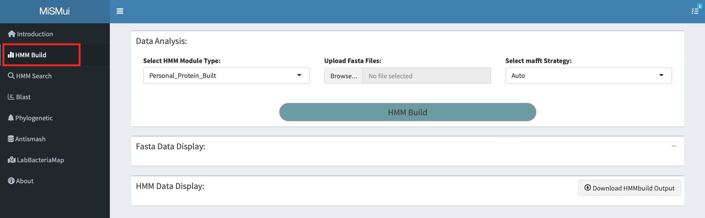
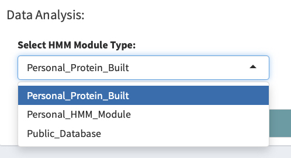
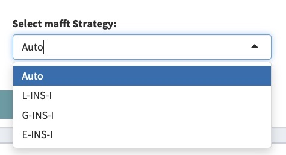
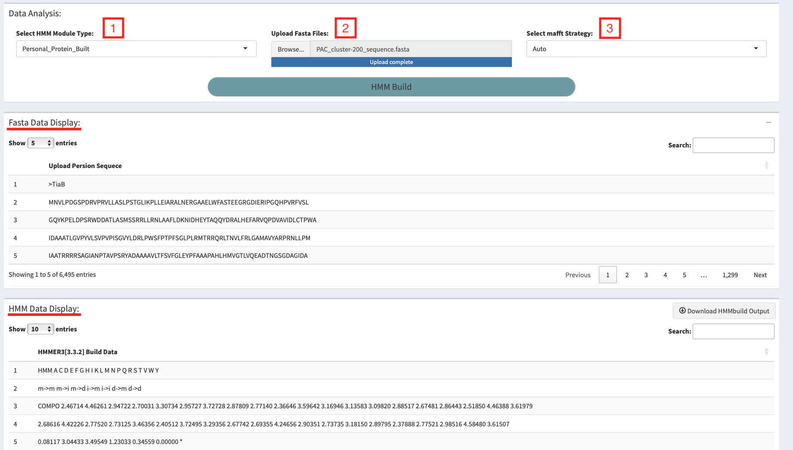
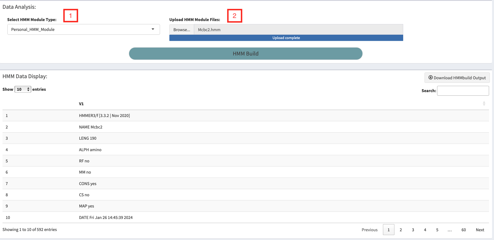

# HMM Build

```{r echo = F, fig.cap = "HMM Build Main Pannel", out.width="100%",fig.align='center'}

```

## HMM Model Introduction
**Hidden Markov model (HMM)** is a probability graph model for sequence labeling, which describes the process that a hidden Markov chain generates an unobservable state sequence, and then generates an observation sequence from each state. In short, a hidden Markov model is generated after machine learning in the algorithm through the known homologous gene sequence, and then we can use this model to predict whether there is such a homologous sequence in the database.

## HMM Model Build
MiSMui supports the analysis of three types of data: 1. Build the HMM model using the local fasta file, 2. Use the HMM model already built locally, and 3. Load the HMM model from the public database.

```{r echo = F, fig.cap = "HMM Build type", out.width="60%",fig.align='center'}

```

After selecting the completed model construction algorithm, the local data is uploaded, and then the user can build the model through the 'HMM Build' button.

### Local Protein File Analysis

After selecting and analyzing the local protein sequence, users can choose HMM Build algorithm. MiSMui provides Auto, L-INS-I, G-INS-I and E-INS-I algorithms to choose from. Generally, choosing Auto can meet the needs of most people.

```{r echo = F, fig.cap = "HMM Build algorithm", out.width="60%",fig.align='center'}

```

After selecting the model construction algorithm, upload the local data. The uploaded data will be displayed in the 'Fasta Data Display' module, and then the user can build the model through the 'HMM Build' button. After completing the construction of the model, it will be displayed in the 'HMM Data Display' module. At the same time, MiSMui provides the download of the model, and users can use the download button in the upper right corner to download.

```{r echo = F, fig.cap = "HMM Build output Pannel", out.width="100%",fig.align='center'}

```

### Local HMM Model Analysis

In addition to local protein sequence modeling, MiSMui also supports the built local HMM model, and then users can upload the model through the 'HMM Build' button. It will be shown in the 'HMM Data Display' module after the upload is completed.

```{r echo = F, fig.cap = "HMM Build Local Model", out.width="100%",fig.align='center'}

```

### Public Database

MiSMui also provides an analysis of the HMM model in the public database, and this part of the function is still under construction...
Therefore, we recommend downloading the HMM model of interest from the public database (such as *InterPro* <https://www.ebi.ac.uk/interpro/> )  and then uploading the HMM model locally for analysis.
