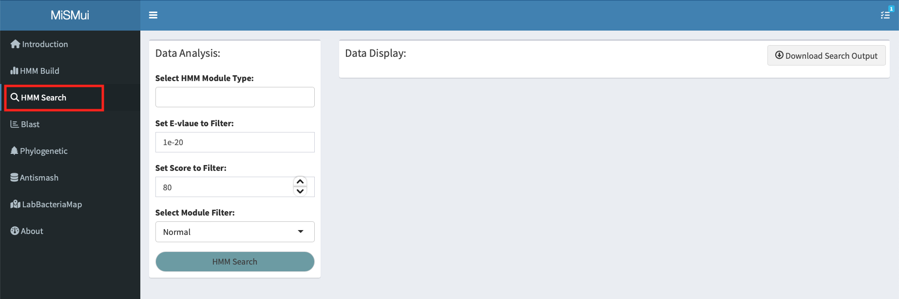
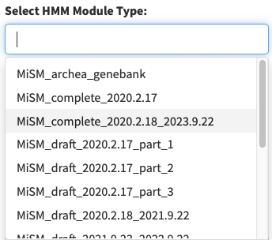
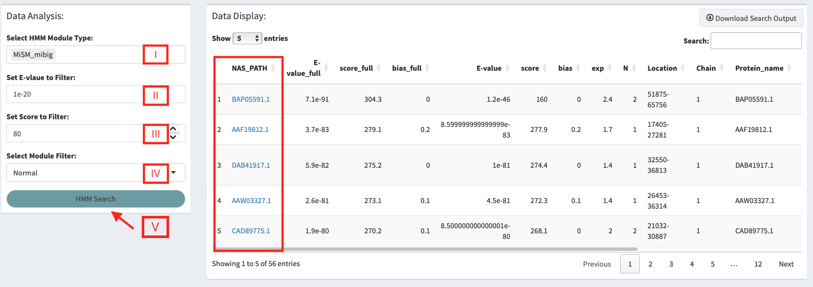
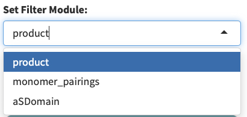
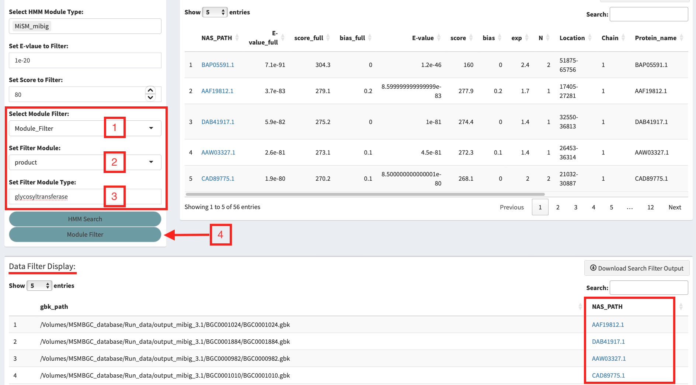

# HMM Search

After completing the analysis of the HMM Build module, click **'HMM Search'** in the MiSMui navigation bar to enter the HMM Search module, which can retrieve the data in the entire database of MiSMui based on the built HMM model, so as to obtain sequence information similar to the model protein.

See Figure \@ref(fig:2-1).

```{r 2-1, echo = F, fig.cap = "HMM Search main Pannel", out.width="100%",fig.align='center'}

```

## HMM Search Basic Analyis

First of all, select the data to be selected in the **MiSM database**. Users can select the data of interest according to the **'Select HMM Module Type'** button. This knob supports the selection of multiple data at the same time. See Figure \@ref(fig:2-2).

```{r 2-2, echo = F, fig.cap = "HMM Search Database Type", out.width="60%",fig.align='center'}

```

After selecting the data, the user needs to set the Search threshold. The user can set **E-value** and **Score** to filter the search results according to their own needs.Then click the **'HMM Search'** button for analysis, and the analysis results will be displayed in **'Data Display'** on the right.
Users can click the **'NAS_PATH'** column in the result to enter the Antismash analysis result page of the corresponding protein in the MiSM database. See Figure \@ref(fig:2-3).

```{r 2-3, echo = F, fig.cap = "HMM Search Database Type", out.width="100%",fig.align='center'}

```

## HMM Search Expanded analysis

In addition to providing basic retrieval functions, MiSMui also provides extended filtering functions. Users can customize their projects based on 'product', 'monomer_pairings', 'aSDomain' and other information to obtain more accurate similar protein sequences.(Figure \@ref(fig:2-4)).

```{r 2-4, echo = F, fig.cap = "HMM Search Database Type", out.width="60%",fig.align='center'}

```

After completing the filtering setting of the data (Figure \@ref(fig:2-4)), click the 'Module Filter' button to filter the HMM Search results. The results are displayed in the 'Data Filter Display' section. Users can also enter the MiSM database through the NAS_PATH column to view the Antismash results corresponding to the protein.(Figure \@ref(fig:2-5)).

```{r 2-5, echo = F, fig.cap = "HMM Search Database Type", out.width="100%",fig.align='center'}

```

