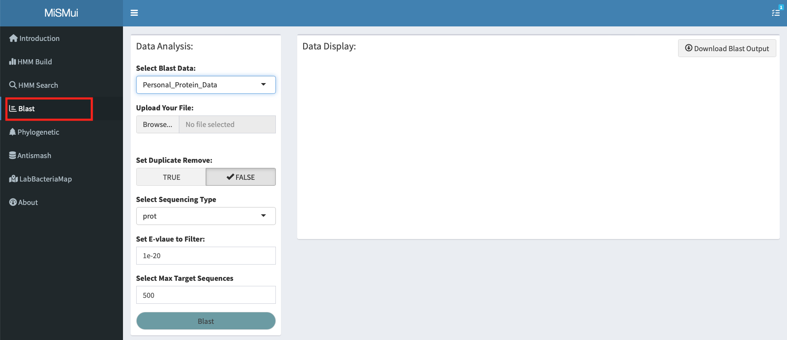
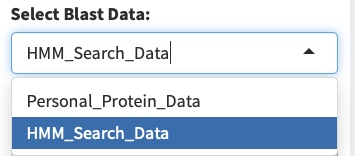
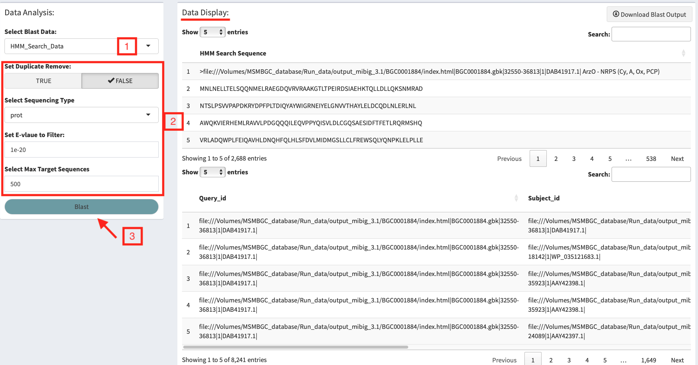
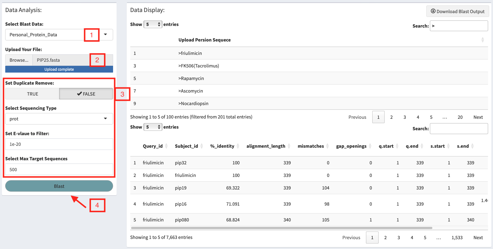

# Blast
## Blast Introduction

The Basic Local Alignment Search Tool (BLAST) finds regions of local similarity between sequences. The program compares nucleotide or protein sequences to sequence databases and calculates the statistical significance of matches. BLAST can be used to infer functional and evolutionary relationships between sequences as well as help identify members of gene families.

## Blast 
BLAST is a set of programs provided by NCBI to align the query sequence with the query sequence in the selected target database. In order to make it more convenient for users to use the MiSM database, MiSMui combines it with HMM Search to obtain similar sequences more accurately.

```{r 3-1, echo = F, fig.cap = "Blast main Pannel", out.width="100%",fig.align='center'}

```

### Blast Input
The built-in BLAST in MiSMui supports two kinds of data reading, one is HMM Search results as input, and the other is to upload local sequences as input.

```{r 3-2, echo = F, fig.cap = "Blast main Pannel", out.width="50%",fig.align='center'}

```

### Blast-HMM Search Sequences Analysis

After completing HMM Search, users can blast the search results with each other. After selecting the analysis of the Search results, MISMui will display the Search result sequence on the right side of **"Data Display"**, and then the user can set the Blast parameter, including **deduplication**, **select the sequence type**, **set the E value**, **Set the maximum sequence** and other parameters, and then click the "Explosion" button for analysis, and the analysis results are displayed on the right.

```{r 3-4, echo = F, fig.cap = "Blast-Search Sequnce Analysis", out.width="100%",fig.align='center'}

```

### Blast-Local Sequences Analysis

Another analysis method of Blast is to upload the local sequence for analysis. After selecting the local sequence analysis, the user needs to upload the local sequence Fasta file. After successful long transmission, it will be displayed on the right side of **'Data Display'**, and then set the Blast parameter, including  **deduplication**, **Select sequence type**, **Set E-value**, **Set Max Sequence** and other parameters, and then click the 'Blast' button for analysis, and the analysis results are displayed on the right side.

```{r 3-3, echo = F, fig.cap = "Blast-Loacl Sequence Analysis", out.width="100%",fig.align='center'}

```

