# Phylogenetic Tree


## Introduction 

The systematic tree, also known as the evolutionary tree, is a tree that indicates the evolutionary relationship between species believed to have a common ancestor. It is a kind of family branch classification method. In the tree, each node represents the nearest common ancestor of its branches, and the length of the line segment between the nodes corresponds to the evolutionary distance.

```{r 4-1, echo = F, fig.cap = "Phylogenetic main Pannel", out.width="100%",fig.align='center'}
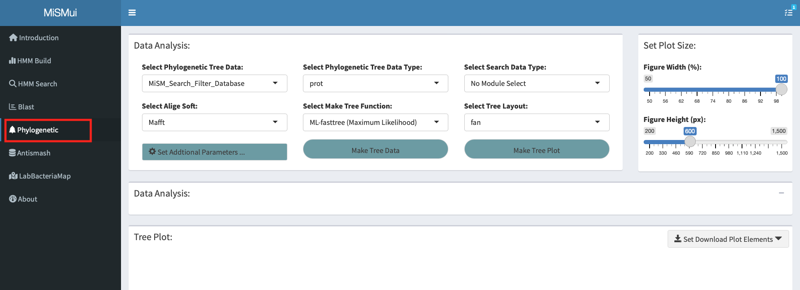
```

## Analysis

MiSMui provides analysis of three sequence data, including **local Fasta Data Analysis**, **local Tree Data Analysis** and **HMM Search Filter Data  analysis** (**under construction**). Users can analyze according to their own choices.

```{r 4-2, echo = F, fig.cap = "Phylogenetic Analysis Type", out.width="50%",fig.align='center'}
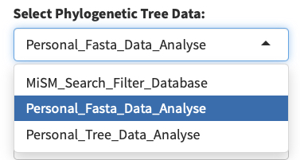
```


### Local Fasta Data Analysis

Local sequence analysis is divided into two steps, firstly, data analysis, comparison according to the uploaded data, tree analysis, and then visual display of fruit results.

#### Data Analysis

```{r 4-3, echo = F, fig.cap = "Phylogenetic Analysis Step", out.width="100%",fig.align='center'}
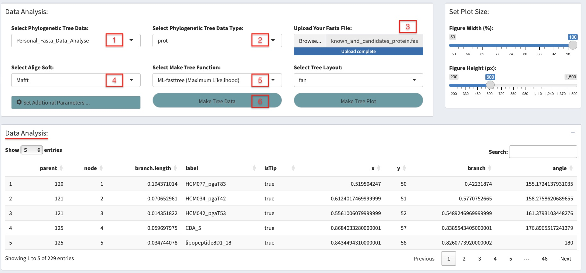
```

For local sequence analysis, first of all, sequence alignment and cropping is carried out. MiSMui provides two mainstream alignment software, *Mafft* and *Muscle*, to align the sequence *(Mafft is faster)*, and *Trimal* software to crop the aligned sequence files, so that more accurate results can be obtained.

```{r 4-4, echo = F, fig.cap = "Alignment Soft Select", out.width="50%",fig.align='center'}
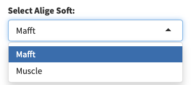
```

At the same time, MiSMui provides a variety of tree-building algorithms, including using *Fasttree* software to build ML (Maximum Likelihood method), using R packet *phangorn* to build NJ (Neighbor-joining) and UPGMA（Unweighted Pair Group Method With Arithmetic Means）based on sequence genetic distance.

```{r 4-5, echo = F, fig.cap = "Tree Function Type", out.width="50%",fig.align='center'}
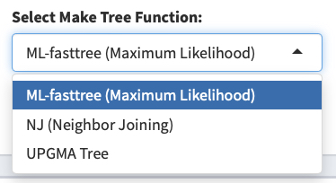
```

After setting the parameters, the system evolution tree can be built through the **'Make Tree Data'** button. After successful construction, the evolution tree data will be displayed in the **'Data Display'** module, which contains branch nodes, end nodes and other information.

```{r 4-6, echo = F, fig.cap = "Tree Data Display ", out.width="100%",fig.align='center'}
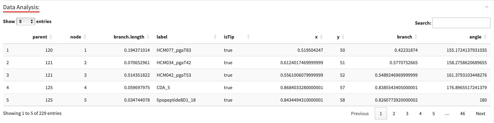
```

#### Visual Display

```{r 4-7, echo = F, fig.cap = "Phylogenetic Visual Step", out.width="100%",fig.align='center'}
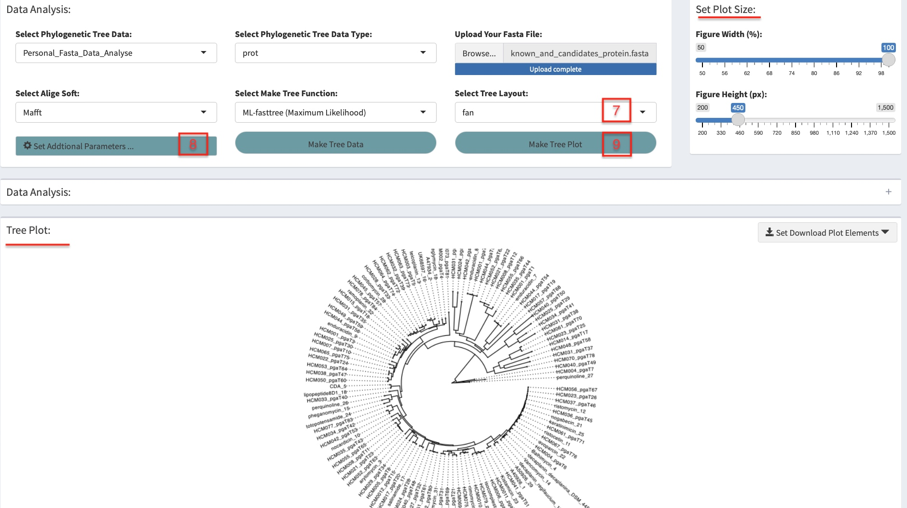
```

Next, the user can choose the visual type. MiSMui provides more than ten types of drawing methods such as 'fan' , 'circle' and 'rectangular'. It is recommended to choose the mainstream drawing type of 'rectangular' or 'fan'.

```{r 4-8, echo = F, fig.cap = "Tree Layout Type", out.width="50%",fig.align='center'}
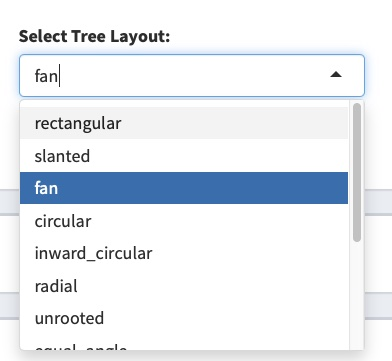
```

In addition, users can click the **"Set Additionl Parameters"** button to set the parameters of the evolution tree, including the basic parameter setting and the expansion parameter setting. Through the basic parameter setting, the user can set the size, location and thickness of the evolution tree. Through the expansion parameter setting, the user can choose the root of the evolution tree according to the node number of the tree, and set the highlighted nodes and area.

```{r 4-9, echo = F, fig.cap = "Set Tree Parameters", out.width="80%",fig.align='center'}
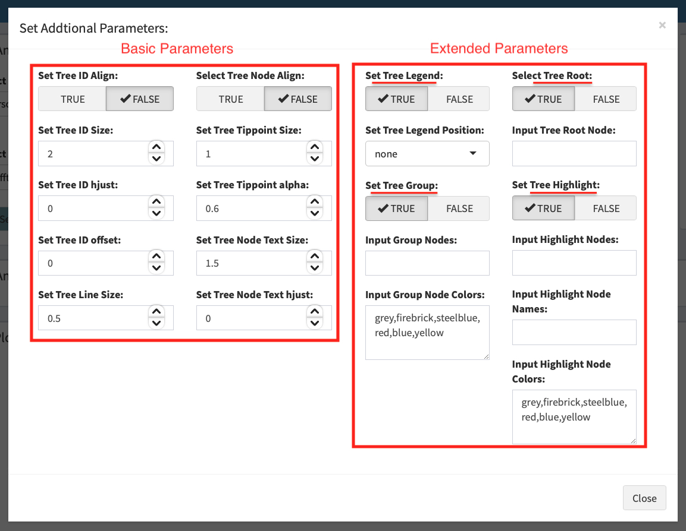
```

After setting the parameters, click the **"Make Tree Plot"** button for visualization, and you can set the size of the drawing board through the Set Plot Size button on the right. At the same time, MiSMui provides download controls for high-quality pictures, and users can use the button in the upper right corner of the drawing board to download.

```{r 4-10, echo = F, fig.cap = "Phylogenetic Tree Display", out.width="100%",fig.align='center'}
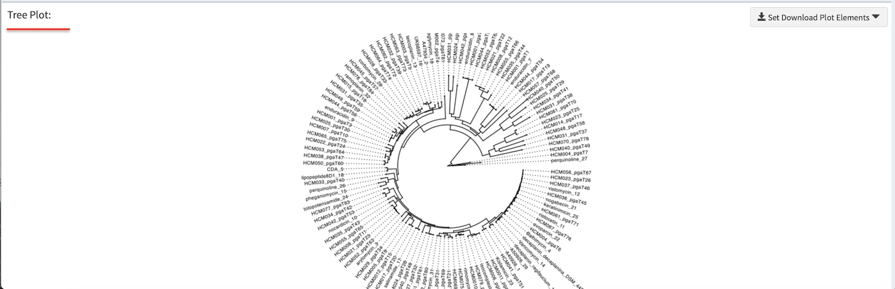
```

### Local Tree Data Analysis

MiSMui can also visually analyze the tree data that has been build. First, select the data source as' Personal_Tree_Data_Analysis', then select the data to upload, and then click the 'Make Tree Data' button to read the tree file. MiSMui supports tree file types with multiple suffixes ('.nwk', '. newick')

```{r 4-11, echo = F, fig.cap = "Phylogenetic Analysis Step", out.width="100%",fig.align='center'}
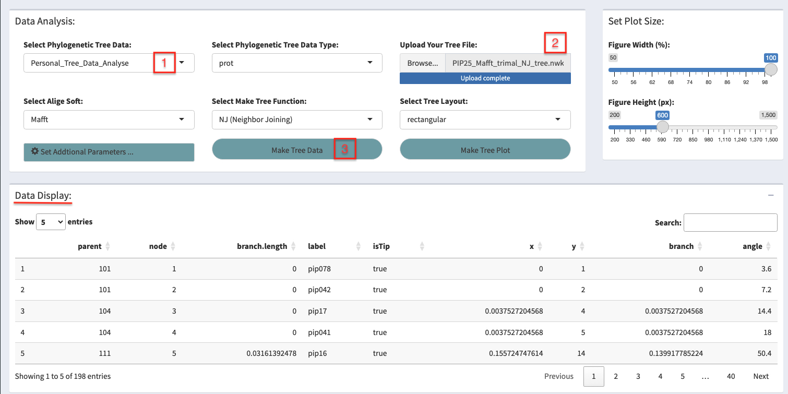
```

Then select the display type through 'Select Tree Layout' and highlight the branch of the evolutionary tree you are interested in through the 'Set Addition Parameters' parameter setting section.

```{r 4-12, echo = F, fig.cap = "Set Tree Parameters", out.width="80%",fig.align='center'}
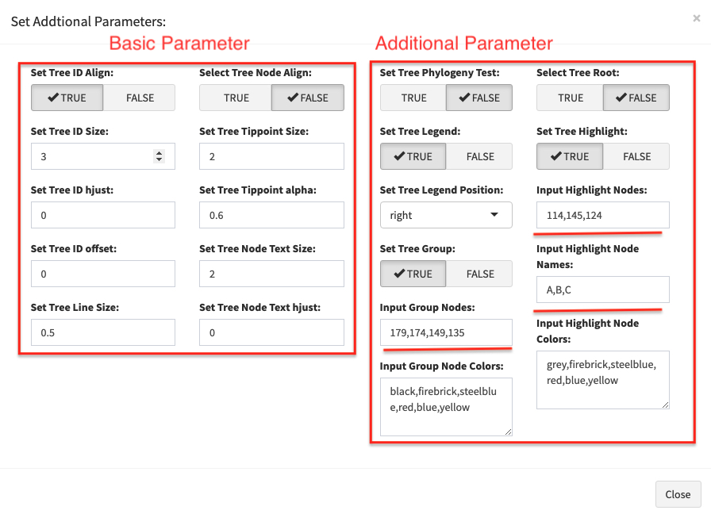
```

After setting the parameters, click 'Make Tree Plot' for visualization.

```{r 4-13, echo = F, fig.cap = "Phylogenetic Tree Display", out.width="100%",fig.align='center'}
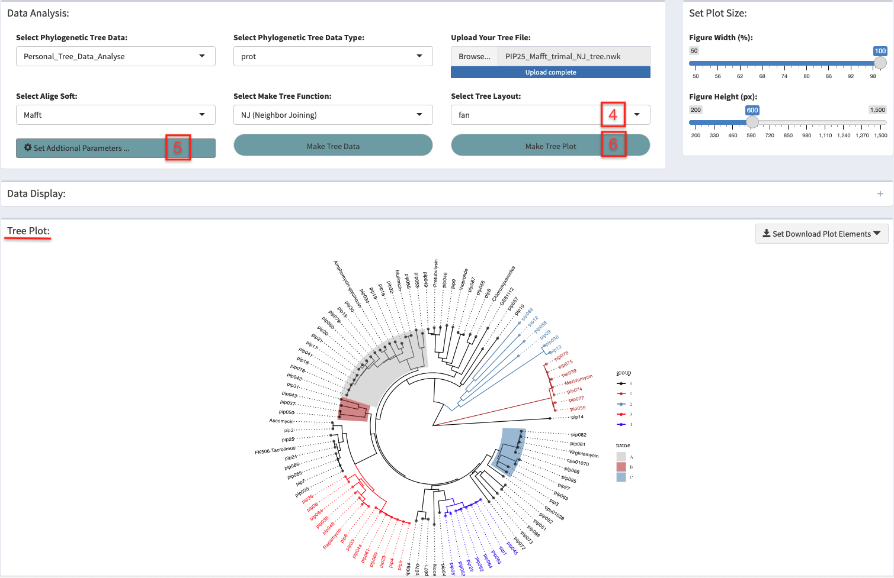
```

### HMM Search Filter Data Analysis
under construction...
