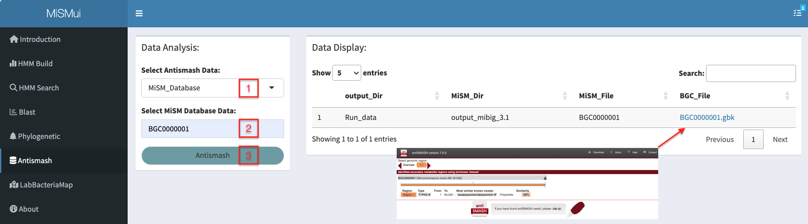

# Antismash


## Antismash Introduction
The antiSMASH framework allows the detection of clusters of co-occurring biosynthesis genes in genomes, called Biosynthetic Gene Clusters (BGCs). BGCs often contain all the genes required for the biosynthesis of one or more Natural Products (NPs), also known as specialized or secondary metabolites. NPs show interesting biological activities and many of them have been developed into essential medicines, including antibiotics (penicillin, streptomycin), anti-cancer drugs (bleomycin, doxorubicin), or cholesterol-lowering agents (lovastatin). This makes NPs and their encoding BGCs highly relevant from both a commercial and scientific perspective.

```{r 5-1, echo = F, fig.cap = "Phylogenetic Analysis Step", out.width="100%",fig.align='center'}

```

## Antismash Analysis

After encapsulation of Antismash7.0, MiSMui can analyze the genomes from three sources: MiSM database, locally uploaded genome and NCBI genome.

```{r 5-2, echo = F, fig.cap = "MiSM Database Analysis", out.width="50%",fig.align='center'}

```

### MiSM Database

For MiSM database, because all genomes have been analyzed by Antismash 7.0, users can search directly according to the keywords of genome ID, and click the hyperlink in the search result to view the analysis result of genome.

```{r 5-3, echo = F, fig.cap = "MiSM Database Analysis", out.width="100%",fig.align='center'}

```

### Personal Data Analysis

For the local genome, users upload the genome through the upload control, select the analysis parameters of Antismash, click the 'Antismash' button for analysis, and view the analysis results through hyperlinks after the analysis is completed.

```{r 5-4, echo = F, fig.cap = "Persional Data Analysis", out.width="100%",fig.align='center'}

```

### NCBI Accession ID

For the data in the NCBI database, the user can input the NCBI Accession ID corresponding to the data, then select the analysis parameters and analyze them, and then view the analysis results through hyperlinks after the analysis is completed

```{r 5-5, echo = F, fig.cap = "NCBI Analysis", out.width="100%",fig.align='center'}

```
