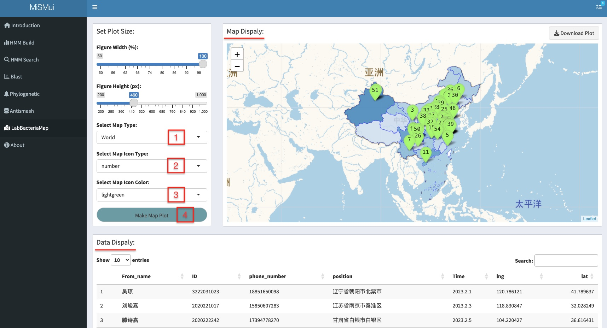
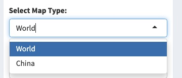
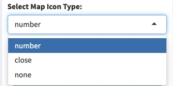
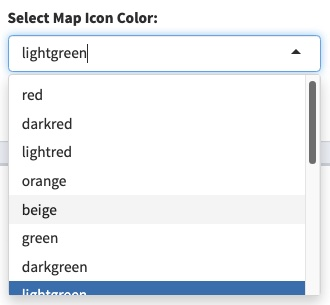
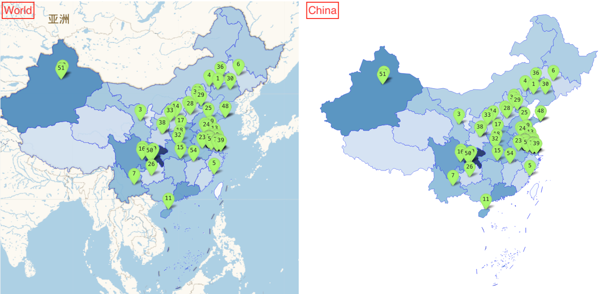

# Lab Bacteria Map

## Introduction

In order to mark the origin of laboratory bacteria, MiSMui constructed a map for labeling through leave, so as to intuitively show the origin and distribution of laboratory bacteria.

## Analysis

```{r 6-1, echo = F, fig.cap = "MiSM LabBacteriaMap", out.width="100%",fig.align='center'}

```

MiSMui provides two types of map modes, one is to highlight the map of China on the world map, and the other is to display only the map of China. Users can choose according to 'Select Map Type'.

```{r 6-2, echo = F, fig.cap = "MiSM LabBacteriaMap Type", out.width="50%",fig.align='center'}

```

MiSMui provides three choices for the contents displayed on the map label: number, close and none. Users can choose for themselves.

```{r 6-3, echo = F, fig.cap = "Set MiSM LabBacteriaMap Label", out.width="50%",fig.align='center'}

```
For map label colors, MiSMui also provides a large number of colors for users to choose from.

```{r 6-4, echo = F, fig.cap = "Set MiSM LabBacteriaMap Label Color", out.width="50%",fig.align='center'}

```

Renderings of MiSMui Maps.

```{r 6-5, echo = F, fig.cap = "MiSM LabBacteriaMap Display", out.width="100%",fig.align='center'}

```
