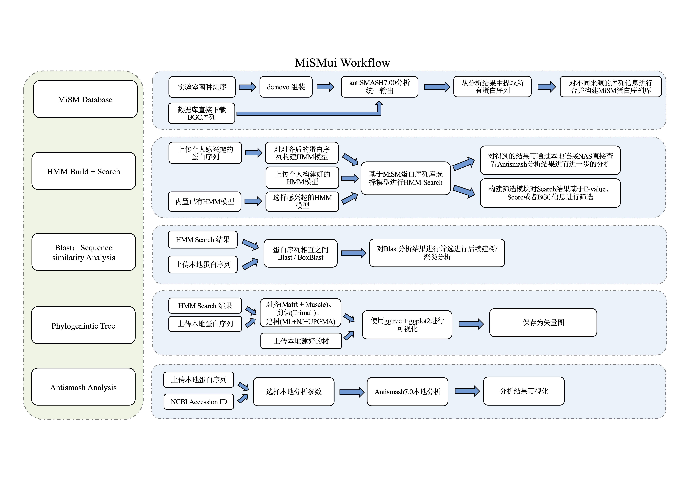

# Introduction

**MiSMui** is an R shiny application that can be easily launched from a local web browser to help scientists without programming expertise to analyze (MiSM Database) microbial secondary metabolites biosynthesis gene cluster database.

## Background

**The secondary metabolism** of microbial flora has produced some bioactive compounds with potential medicinal value, including biosynthetic pathways of many chemicals, some of which have been used as antibiotics, cholesterol-lowering drugs or anti-tumor drugs. The biosynthetic genes responsible for encoding these secondary metabolites are usually gathered at a certain location in the chromosome. Such genes are called **"secondary metabolites biosynthetic gene clusters"** (**BGC**). Through the analysis of gene clusters in secondary metabolites in the genetic structure, they can biosynthesize secondary metabolites. Make a way to make predictions.

In order to explore biosynthesis more comprehensively, we have built a **MiSM database**. **MiSM database** can provide interested BGC-related information based on a large number of microbial flora, which can help researchers study the biosynthesis pathways of flora more comprehensively. The data sources of the **MiSM database** include the microbial flora and laboratory internal flora that have been reported in NCBI.At the same time, in order to better use the **MiSM database** , we have built an interactive analysis tool called **MiSMui** based on the Rshiny framework. **MiSMui** can search the **MiSM database** through the HMM model to identify similar sequences, and at the same time, it can perform Blast on protein sequences of interest to further analyze their similarities. In short, **MiSMui** is designed to serve the **MiSM database**.

```{r echo = F, fig.cap = "MiSMui-Workflow", out.width="100%",fig.align='center'}

```

## About
### Relate Tools

#### HMMer
**HMMER** is used for searching sequence databases for sequence homologs, and for making sequence alignments. It implements methods using probabilistic models called profile hidden Markov models (profile HMMs).
**HMMER** is often used together with a profile database, such as Pfam or many of the databases that participate in Interpro. But **HMMER** can also work with query sequences, not just profiles, just like BLAST. For example, you can search a protein query sequence against a database with phmmer, or do an iterative search with jackhmmer.
**HMMER** is designed to detect remote homologs as sensitively as possible, relying on the strength of its underlying probability models. In the past, this strength came at significant computational expense, but as of the new HMMER3 project, HMMER is now essentially as fast as BLAST.
**HMMER** can be downloaded and installed as a command line tool on your own hardware, and now it is also more widely accessible to the scientific community via new search servers at the European Bioinformatics Institute.

#### Antismash
The **antiSMASH** framework allows the detection of clusters of co-occurring biosynthesis genes in genomes, called Biosynthetic Gene Clusters (BGCs). BGCs often contain all the genes required for the biosynthesis of one or more Natural Products (NPs), also known as specialized or secondary metabolites. NPs show interesting biological activities and many of them have been developed into essential medicines, including antibiotics (penicillin, streptomycin), anti-cancer drugs (bleomycin, doxorubicin), or cholesterol-lowering agents (lovastatin). This makes NPs and their encoding BGCs highly relevant from both a commercial and scientific perspective.

#### Blast+
The NCBI provides a suite of command-line tools to run **BLAST** called **BLAST+** . This allows users to perform **BLAST** searches on their own server without size, volume and database restrictions. **BLAST+**  can be used with a command line so it can be integrated directly into your workflow.
The Basic Local Alignment Search Tool (**BLAST**) finds regions of local similarity between sequences. The program compares nucleotide or protein sequences to sequence databases and calculates the statistical significance of matches. **BLAST** can be used to infer functional and evolutionary relationships between sequences as well as help identify members of gene families.

### Relete Database
#### NCBI
The NCBI database is a collection of online resources that provide access to information on genomes, genes, proteins, chemicals, and other biological data. The NCBI database includes the following features: 

**NCBI Genome:** A resource that organizes information on genomes, including sequences, maps, chromosomes, assemblies, and annotations. Users can browse by organism, download data, or submit their own genome data. 
**NCBI Assembly:** A resource that provides access to genome assemblies from various sources, such as GenBank, RefSeq, and T2T. Users can search, download, or compare genome assemblies. 
**NCBI BioProject:** A resource that provides an overview of the biological data available for a given project. Users can search, browse, or submit BioProjects, which are collections of related data sets. 
**NCBI BioSample:** A resource that provides information on the biological source materials used in genomic studies. Users can search, browse, or submit BioSamples, which are records of the origin, collection, and processing of biological specimens. 
**NCBI Genome Data Viewer:** A resource that allows users to visualize and explore genomic data, such as annotations, variants, expression, and alignments. Users can upload their own data or use data from NCBI or other sources. 
**NCBI Datasets:** A resource that provides easy access to genome sequence and annotation data. Users can download data sets for a given taxon, gene, or protein, or use the Datasets tools to analyze and compare genomic data.

#### Antismash Database
**The antiSMASH database offers researchers four main pieces of funtionality. **
It is possible to browse the database by phylogeny or secondary metabolite type, giving an exploratory overview of the avaliable biosynthetic gene cluster predictions. Selecting a cluster for closer inspection will redirect to the antiSMASH results page, offering all the usual annotations. 
Alteratively, it is possible to query for specific biosynthetic gene cluster types, monomers and many more. The "build a query" page allows to construct complicated, detailed queries in an easy manner. 
If you want to find BGC regions containing protein sequences similar to a protein you are interested in, or containing a RiPP core peptide similar to a core peptide you are interested in, the protein sequence search is the tool to used. 
Lastly, a number of summary statistics are available to give a general idea of the types of secondary metabolite production represented by the database.

#### Mibig Database
**The Minimum Information about a Biosynthetic Gene cluster (MIBiG)** specification provides a robust community standard for annotations and metadata on biosynthetic gene clusters and their molecular products. 
**MIBiG** is a Genomic Standards Consortium project that builds on the Minimum Information about any Sequence (MIxS) framework. 
**MIBiG** will facilitate the standardized deposition and retrieval of biosynthetic gene cluster data as well as the development of comprehensive comparative analysis tools. It will empower next-generation research on the biosynthesis, chemistry and ecology of broad classes of societally relevant bioactive secondary metabolites, guided by robust experimental evidence and rich metadata components. 
The JSON specifications of the **MIBiG** schema and options are freely available for download and can be used to validate **MIBiG** data from other sources. Also, a tarball with all **MIBiG** entries in raw JSON format is available for download. To get an idea of what kind of information is included in **MIBiG** entries, please have a look at the visualized entries for erythromycin, actinorhodin, calcium-dependent antibiotic, microbisporicin and marneral. They can be downloaded in JSON format by clicking the corresponding button (down-pointing arrow) at the top right of their page.

